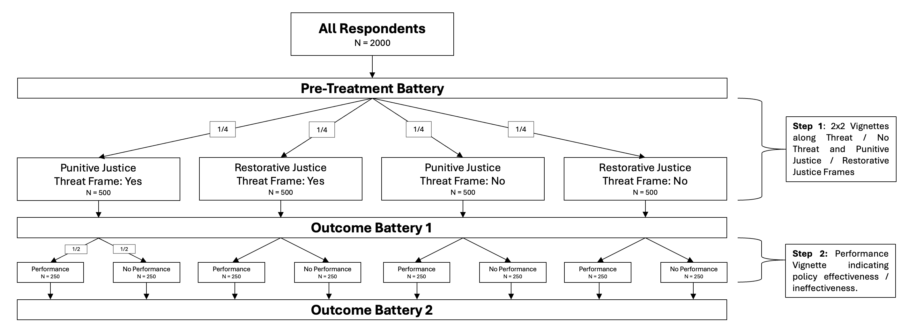

```{r}
#| include: false

# packages
pacman::p_load(tidyverse, rio, DeclareDesign, estimatr, scales)
```

# Theory

# Design

We want to implement a two-step vignette design. First, respondents are surveyed on pre-treatment variables (likely we can look for synergies in variables with other teams). Within our experiment, they are then divided into four equal vignettes along the dimensions *Restorative Justice* / *Punitive Justice* and *Threat Frame* / *No Threat Frame* and asked the first set of outcome questions. Following this, subsamples are assigned to a performance / no performance vignette and are asked the outcome battery again.

This design allows us to (1) test [@lachapelle2022] triadic theory on repression; and (2) advance the theory with a performance dimension [@przeworski2023]. In total, we expect the design to take up 4–5 minutes maximum. @fig-experiment_flowchart illustrates the experiment design. 

{#fig-experiment_flowchart}

## Design Declaration

We evaluate the design with the `DeclareDesign` package. The **model** assumes additive effects for the Stage 1 treatments (justice and threat frames) on support for repressive policy (0–10 scale), but allows the Stage 2 performance effect to vary across Stage 1 cells—reflecting our expectation that the performance vignette operates differently depending on the prior framing. Baseline parameters (population mean μ = 5, standard deviation σ = 2) are somewhat arbitrary at this stage.

 The **inquiry** consists of two marginal ATEs for the Stage 1 factors (estimated from Y1) and four conditional ATEs for the performance treatment, one per Stage 1 cell (estimated from Y2).
 
 The **data strategy** mirrors the two-stage complete random assignment depicted in @fig-experiment_flowchart: justice and threat frames are assigned to four cells of 500, outcomes are measured (Y1), and the performance treatment is then assigned within each cell to sub-groups of 250, after which outcomes are measured again (Y2).
 
The **answer strategy** uses heteroskedasticity-robust OLS (HC2 standard errors), with the conditional performance effects estimated by subsetting Y2 to each Stage 1 cell.

```{r}
#| label: design-declaration

# set seed
set.seed(030)

# declaration 
declare_repression_design <- function(

  # total sample size
  N              = 2000,
  # assumed population average on the outcome
  mu             = 5,
  # assumed standard deviation of the outcome
  sigma          = 2,
  # assumed true effect of the justice treatment (marginal, from Y1)
  tau_justice    = 0.3,
  # assumed true effect of the threat treatment (marginal, from Y1)
  tau_threat     = 0.3,
  # cell-specific performance effects (Stage 1 x Stage 2 interaction)
  # the performance vignette effect is allowed to differ across Stage 1 cells
  # update these with substantive priors once available
  tau_perf_j0_t0 = 0.3,  # Restorative Justice x No Threat
  tau_perf_j1_t0 = 0.3,  # Punitive Justice    x No Threat
  tau_perf_j0_t1 = 0.3,  # Restorative Justice x Threat
  tau_perf_j1_t1 = 0.3   # Punitive Justice    x Threat
) {

  # M: Model ------------------------------------------------------------------
  model <- declare_model(
    N = N,
    # random baseline noise term drawn from a normal distribution
    U = rnorm(N, 0, sigma),
    # post-vignette potential outcomes (before performance treatment)
    # four counterfactual Y1s per respondent (one per 2x2 cell)
    potential_outcomes(
      Y1 ~ mu + tau_justice * Z_justice + tau_threat * Z_threat + U,
      conditions = list(Z_justice = c(0, 1), Z_threat = c(0, 1))
    ),
    # post-performance potential outcomes: interaction model
    # the performance effect is allowed to differ by Stage 1 cell
    # eight counterfactual Y2s per respondent (one per 2x2x2 cell)
    potential_outcomes(
      Y2 ~ mu + tau_justice * Z_justice + tau_threat * Z_threat +
           (tau_perf_j0_t0 * (1 - Z_justice) * (1 - Z_threat) +
            tau_perf_j1_t0 * Z_justice        * (1 - Z_threat) +
            tau_perf_j0_t1 * (1 - Z_justice)  * Z_threat       +
            tau_perf_j1_t1 * Z_justice         * Z_threat) * Z_performance + U,
      conditions = list(
        Z_justice     = c(0, 1),
        Z_threat      = c(0, 1),
        Z_performance = c(0, 1)
      )
    )
  )

  # I: Inquiry ----------------------------------------------------------------
  # Marginal ATE for justice frame, averaged over threat conditions (from Y1)
  inquiry_justice <- declare_inquiry(
    ATE_Justice = mean(
      (Y1_Z_justice_1_Z_threat_0 + Y1_Z_justice_1_Z_threat_1) / 2 -
      (Y1_Z_justice_0_Z_threat_0 + Y1_Z_justice_0_Z_threat_1) / 2
    )
  )

  # Marginal ATE for threat frame, averaged over justice conditions (from Y1)
  inquiry_threat <- declare_inquiry(
    ATE_Threat = mean(
      (Y1_Z_justice_0_Z_threat_1 + Y1_Z_justice_1_Z_threat_1) / 2 -
      (Y1_Z_justice_0_Z_threat_0 + Y1_Z_justice_1_Z_threat_0) / 2
    )
  )

  # Conditional ATEs of performance within each Stage 1 cell (from Y2)
  inquiry_perf_j0_t0 <- declare_inquiry(
    ATE_Perf_Restorative_NoThreat = mean(
      Y2_Z_justice_0_Z_threat_0_Z_performance_1 -
      Y2_Z_justice_0_Z_threat_0_Z_performance_0
    )
  )

  inquiry_perf_j1_t0 <- declare_inquiry(
    ATE_Perf_Punitive_NoThreat = mean(
      Y2_Z_justice_1_Z_threat_0_Z_performance_1 -
      Y2_Z_justice_1_Z_threat_0_Z_performance_0
    )
  )

  inquiry_perf_j0_t1 <- declare_inquiry(
    ATE_Perf_Restorative_Threat = mean(
      Y2_Z_justice_0_Z_threat_1_Z_performance_1 -
      Y2_Z_justice_0_Z_threat_1_Z_performance_0
    )
  )

  inquiry_perf_j1_t1 <- declare_inquiry(
    ATE_Perf_Punitive_Threat = mean(
      Y2_Z_justice_1_Z_threat_1_Z_performance_1 -
      Y2_Z_justice_1_Z_threat_1_Z_performance_0
    )
  )

  # D: Data Strategy ----------------------------------------------------------
  # Stage 1: complete random assignment to 2x2 (500 per cell)
  assign_justice <- declare_assignment(Z_justice     = complete_ra(N, prob = 0.5))
  assign_threat  <- declare_assignment(Z_threat      = complete_ra(N, prob = 0.5))
  measure_Y1     <- declare_measurement(Y1 = reveal_outcomes(Y1 ~ Z_justice + Z_threat))

  # Stage 2: complete random assignment to performance (250 per sub-cell)
  assign_performance <- declare_assignment(Z_performance = complete_ra(N, prob = 0.5))
  measure_Y2         <- declare_measurement(
    Y2 = reveal_outcomes(Y2 ~ Z_justice + Z_threat + Z_performance)
  )

  # A: Answer Strategy --------------------------------------------------------
  # Marginal Stage 1 effects estimated on Y1
  estimator_justice <- declare_estimator(
    Y1 ~ Z_justice,
    .method = lm_robust, term = "Z_justice",
    inquiry = "ATE_Justice", label = "Justice Frame"
  )

  estimator_threat <- declare_estimator(
    Y1 ~ Z_threat,
    .method = lm_robust, term = "Z_threat",
    inquiry = "ATE_Threat", label = "Threat Frame"
  )

  # Conditional performance effects: subset Y2 to each Stage 1 cell
  estimator_perf_j0_t0 <- declare_estimator(
    Y2 ~ Z_performance, .method = lm_robust,
    subset = Z_justice == 0 & Z_threat == 0,
    term = "Z_performance",
    inquiry = "ATE_Perf_Restorative_NoThreat", label = "Perf: Restorative, No Threat"
  )

  estimator_perf_j1_t0 <- declare_estimator(
    Y2 ~ Z_performance, .method = lm_robust,
    subset = Z_justice == 1 & Z_threat == 0,
    term = "Z_performance",
    inquiry = "ATE_Perf_Punitive_NoThreat", label = "Perf: Punitive, No Threat"
  )

  estimator_perf_j0_t1 <- declare_estimator(
    Y2 ~ Z_performance, .method = lm_robust,
    subset = Z_justice == 0 & Z_threat == 1,
    term = "Z_performance",
    inquiry = "ATE_Perf_Restorative_Threat", label = "Perf: Restorative, Threat"
  )

  estimator_perf_j1_t1 <- declare_estimator(
    Y2 ~ Z_performance, .method = lm_robust,
    subset = Z_justice == 1 & Z_threat == 1,
    term = "Z_performance",
    inquiry = "ATE_Perf_Punitive_Threat", label = "Perf: Punitive, Threat"
  )

  # MIDA ----------------------------------------------------------------------
  model +
    inquiry_justice + inquiry_threat +
    inquiry_perf_j0_t0 + inquiry_perf_j1_t0 + inquiry_perf_j0_t1 + inquiry_perf_j1_t1 +
    assign_justice  + assign_threat  + measure_Y1 +
    assign_performance + measure_Y2 +
    estimator_justice + estimator_threat +
    estimator_perf_j0_t0 + estimator_perf_j1_t0 + estimator_perf_j0_t1 + estimator_perf_j1_t1
}

# declare 
base_design <- declare_repression_design()

# diagnose
diagnosis <- diagnose_design(base_design, sims = 1000)

# display
diagnosis$diagnosands_df |>
  select(
    Treatment  = estimator,
    `True ATE` = mean_estimand,
    Estimate   = mean_estimate,
    Bias       = bias,
    SD         = sd_estimate,
    RMSE       = rmse,
    Power      = power,
    Coverage   = coverage
  ) |>
  mutate(across(where(is.numeric), \(x) round(x, 3))) |>
  knitr::kable(
    caption = "Design diagnosis (1,000 simulations, τ = 0.3 for all effects, N = 2,000)",
    align   = c("l", rep("r", 7))
  )
```

Interpretation: Diagnosands look good for stage 1 and bad for stage 2. 

## Power Analysis for Performance Vignettes

Our main design-based concern right now is that we end up with pretty small N for the second stage analysis of the performance frames: With a total N of 2,000, each cell contains approximately 500 respondents, split 250/250 between performance and no-performance conditions. The effective per-arm sample size for each conditional estimate is therefore 250 per arm available for the marginal performance ATE. @fig-conditional-power shows how power for the performance ATE varies across a range of total sample sizes.

```{r}
#| label: conditional-power-declaration

# Single-cell design: performance treatment within one Stage 1 cell.
# Power depends only on within-cell N and the cell-specific tau,
# so we vary N and tau separately to trace the power surface.

declare_cell_design <- function(N_cell, mu = 5, sigma = 2, tau_performance = 0.3) {

  model <- declare_model(
    N = N_cell,
    U = rnorm(N_cell, 0, sigma),
    potential_outcomes(
      Y ~ mu + tau_performance * Z_performance + U,
      conditions = list(Z_performance = c(0, 1))
    )
  )

  inquiry <- declare_inquiry(
    ATE_Performance = mean(Y_Z_performance_1 - Y_Z_performance_0)
  )

  assignment  <- declare_assignment(Z_performance = complete_ra(N_cell, prob = 0.5))
  measurement <- declare_measurement(Y = reveal_outcomes(Y ~ Z_performance))

  estimator <- declare_estimator(
    Y ~ Z_performance,
    .method = lm_robust, term = "Z_performance",
    inquiry = "ATE_Performance", label = "Performance"
  )

  model + inquiry + assignment + measurement + estimator
}
```

```{r}
#| label: conditional-power-sim
#| cache: true

# Total N values to evaluate; each Stage 1 cell receives N/4 respondents
n_total <- c(1000, 2000, 3000, 4000, 5000, 6000, 8000)

designs_n <- setNames(
  lapply(n_total / 4, function(n) declare_cell_design(N_cell = n)),
  paste0("N = ", n_total)
)

diagnoses_n <- diagnose_design(designs_n, sims = 1000)
```

```{r}
#| label: fig-conditional-power
#| fig-cap: "Statistical power for the performance treatment effect within a single Stage 1 cell (N/4 respondents per cell; N/8 per arm). The dashed line marks the 80% power threshold. Assumes τ = 0.3 scale points, σ = 2; 500 simulations per design."

n_lookup <- tibble(design = paste0("N = ", n_total), N = n_total)

diagnoses_n$diagnosands_df %>% 
  left_join(n_lookup, by = "design") %>% 
  ggplot(aes(x = N, y = power)) +
  geom_line(linewidth = 0.8, color = "#66C2A5") +
  geom_point(size = 2,       color = "#66C2A5") +
  geom_hline(yintercept = 0.80, linetype = "dashed", color = "gray40", linewidth = 0.5) +
  annotate("text", x = 1000, y = 0.83, label = "80% threshold",
           hjust = 0, size = 3.2, color = "gray40") +
  scale_y_continuous(limits = c(0, 1), labels = percent_format(accuracy = 1)) +
  scale_x_continuous(labels = scales::comma) +
  labs(
    x = "Sample Size (N)",
    y = "Power"
  ) +
  theme_minimal(base_size = 12)
```
