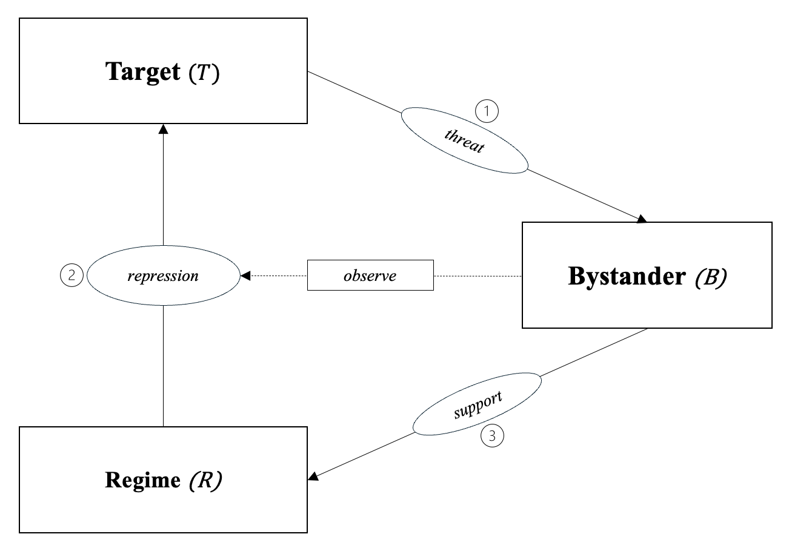

# 1. Question & Motivation

## Research Question

> **Does information about human rights violations shift support for repression?**

::: incremental
- Information about repression can trigger **backlash** — but only under specific conditions (target sympathy, media framing, group identity)
- We lack **causal evidence** on when and why citizen support state-violence
:::

## Theory: A triadic model of repression

- Repression is not dyadic (state ↔ dissidents) — it is **triadic** [@lachapelle2022]:

{width=70% fig-align="center"}

##

| Mechanism | Prediction |
|-----------|------------|
| Threat-conditional legitimation | High threat → more repression support |
| Backlash | Sympathetic targets + HRV info → less support |
| Out-group permissiveness | Out-group targets → support persists even without threat |

## Connection to Broader Research Agenda

- **Daniel:**
- **Jorge:**
- **Giovanna:**

# 2. Key Design Elements

## Population of Interest

| Dimension | Description |
|-----------|-------------|
| Target population | Adult citizens Germany |
| Sampling frame | Online quota sample via [panel provider TBD] |
| Expected N | ~2000 |
| Assumptions | General public are the bystanders in the triadic model |

## Inquiry: Causal Effect Estimation

::: {.columns}
::: {.column width="50%"}
**Inquiry**

*Does information about human rights violations shift support for repression?*

:::
::: {.column width="50%"}
**Data strategy**

Random assignment of information exposure in a survey vignette
:::
:::

. . .

- **Estimand:** ATE of HRV information on support for targeted repression

## Assignment Scheme

**2 × 2 between-subjects factorial design**

|  | Nonthreatening Event | Threatening Event |
|---|---|---|
| **No HRV information** | Control (n = 500) | Threat only (n = 500) |
| **HRV information exposed** | HRV only (n = 500) | Threat + HRV (n = 500) |

##

```{mermaid}
flowchart TD
    A["<b>Sample</b><br/>N = 2,000<br/>Adult citizens, Germany"]
    A --> B["<b>Block: Female</b><br/>n ≈ 1,000"]
    A --> C["<b>Block: Male</b><br/>n ≈ 1,000"]

    B --> B1["Control<br/>n = 250"]
    B --> B2["Threat only<br/>n = 250"]
    B --> B3["HRV only<br/>n = 250"]
    B --> B4["Threat + HRV<br/>n = 250"]

    C --> C1["Control<br/>n = 250"]
    C --> C2["Threat only<br/>n = 250"]
    C --> C3["HRV only<br/>n = 250"]
    C --> C4["Threat + HRV<br/>n = 250"]

    style B1 fill:#d1e7dd,stroke:#0f5132
    style B2 fill:#fff3cd,stroke:#664d03
    style B3 fill:#cff4fc,stroke:#055160
    style B4 fill:#f8d7da,stroke:#842029
    style C1 fill:#d1e7dd,stroke:#0f5132
    style C2 fill:#fff3cd,stroke:#664d03
    style C3 fill:#cff4fc,stroke:#055160
    style C4 fill:#f8d7da,stroke:#842029
```

## Analysis Plan

- **Primary estimator:** OLS / difference-in-means (ATE per arm)
- **Primary outcome:** Support for repression 
- **Secondary outcomes:** Trust in police/state; perceived legitimacy of protest; perceived threat to public safety
- **Heterogeneous effects:** authoritarianism, political ideology, prior trust in police

# 3. Implementation

## Team

| Role | Person | Responsibility |
|------|--------|----------------|
| PI | Daniel Kuhlen | PAP, Design |
| Co-I | Giovanna Lapresa | [TBD] |
| Co-I | Jorge Zavala | [TBD] |

## Survey Instrument

- **Flow:** Consent → Screener/covariates → Treatment vignette → Outcome battery → Manipulation check → Debriefing

- **Key blocks:**
  - *Pre-treatment:* age, gender, education, political interest, prior trust in police
  - *Treatment vignette:* ~100–150 word protest scenario
  - *Post-treatment:* repression support, diffuse trust
  - *Manipulation check:* recall of protest characteristics and information exposure

## Timing

| Module | Estimated time |
|--------|---------------|
| Background questions (covariates) | ~1 min |
| Treatment vignette | ~1 min |
| Outcome battery | ~2 min |
| Manipulation check | ~1 min |
| **Total** | **~5 min** |

## Randomisation

- **Method:** ?
- **Procedure:** ?
- **Vignette construction:** Base scenario held constant; threat cue and HRV information paragraph added/removed per condition
- **Balance checks:** Pre-treatment covariates compared across arms; flagged if standardised differences > 0.1

## Risks: Interference & Demand Effects

- **Attrition:** Differential dropout if HRV information is distressing — will monitor dropout rates by condition; include opt-out option
- **Demand effects:** Sensitive topic (police violence) may induce social desirability; mitigated by anonymity guarantee and neutral question framing
- **Manipulation failure:** HRV information may not be read carefully — addressed by comprehension check and attention screener

## Ethical Considerations

- **Sensitive content:** Scenarios describe state violence — may cause discomfort
- **Mitigation:** Content warning on consent screen; opt-out at any point without penalty; text-only stimuli (no graphic images/video)
- **Deception:** TBD
- **Debriefing:** TBD
- **IRB:** WZB (& HU?): For HU next deadline for submission 02-04-2026

# 4. Open Questions

## Questions for the Group

1. **Country context:** 

2. **Event:** Should we use hypothetical scenarios? Real world events? In or outside Germany?

2. **Treatment realism:** How detailed should the HRV information be (brief news headline vs. detailed account), and does detail level affect credibility vs. discomfort trade-offs?

3. **Factorial vs. single-arm:** Is the 2×2 design the right call?

## Literature
